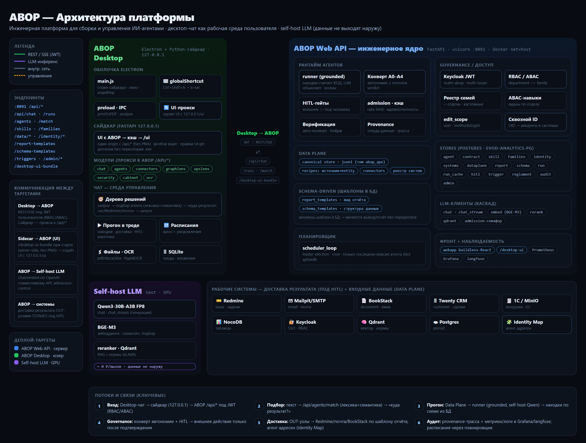

# ABOP — Agent Build & Operations Platform

Среда сборки, запуска и эксплуатации ИИ-агентов в управляемом периметре. Инженерная
половина связки **LUDA → ABOP**: LUDA (аудитор) выдаёт бизнес-вердикт готовности и три
контракта, ABOP по ним собирает, запускает и эксплуатирует агентов под жёстким конвертом
governance.

> **Два продукта — два репозитория.** Отделён из монорепо `ai-product-engineer` (учебный
> портал остаётся там). Переиспользуемые части (MCP-шлюз, навыки, CLI APE, Keycloak, инфра)
> склонированы в оба. Связь между продуктами — только через версионированные контракты, не
> через код (ADR-027). Десктоп ABOP обновляется из **собственного** канала релизов
> (`mkhlsokolenko-ai/abop`), отдельно от десктопа AI Engineer — каналы не смешиваются.

## Возможности

- **Канва процесса** — один граф агента с линзами **Строю / Запускаю / Эксплуатирую / Конверт** (ADR-030).
- **Сборка из контрактов LUDA** — приём бандла (`luda.*/1.0`) через Contract Ingress → `ContractSet` → посев канвы (ADR-029).
- **Конверт governance** — автономия агента ≤ `DeploymentContract` (ADR-013/028): HITL, egress-политика, аудит; UI-гейт редактирования по `can_edit`.
- **Data Plane** — рецепты `source → canonical` по ключу `entity`, OUT-узлы доставки; версионное хранилище с provenance и freshness (последняя версия не протухает по времени).
- **Цепочки агентов** — линейный конвейер «выход одного → контекст следующего» (pipeline-раннер).
- **Tool-calling** («код считает истину, LLM объясняет»):
  - **Графики** — декларативная спека → inline-SVG (bar/line/pie), рендерится в браузере и в PDF.
  - **Whitelisted-расчёты** — фиксированный набор `stats / group_by / top / reconcile` (без `exec`), читает данные через `data_query` под ABAC.
- **Отчёты по кейсам** — шаблоны `audit1c / invest / digest` с авто-выбором по форме результата и встроенными графиками.
- **Регламент-конформанс (sLAVA)** — сверка процесса с регламентом по ключу НСИ на эмбеддингах, drift-детекция, граф-RAG, бейджи конформанса.
- **RBAC агентов на MCP-шлюзе** — изоляция доступа (read-гейт + action-гейт на доставке, deny-by-default, аудит) под сквозным Identity Map.
- **Анализ воздействия** — граф связей: что изменит правка узла, где развёрнуты агенты, цена/токены.
- **Веб-редакторы шаблонов** — визуальная правка HTML-отчётов без передеплоя.
- **Биллинг и квоты** — реальный расход токенов из `RunMetrics` (не хардкод), чип остатка в чате.
- **Observability** — сквозной `trace_id`, `/metrics` (Prometheus), Grafana, тайминги прогона/навыков, мягкие ошибки не глушатся.
- **Десктоп** — тонкий клиент (Electron + Python-сайдкар): чат как среда управления агентами, вход Keycloak + Identity Map, глобальный хоткей `Ctrl+Shift+A` (выделение из любого приложения → анализ), экспорт в PDF, авто-обновление UI (Путь А) и приложения (electron-updater).

## Архитектура



> Интерактивная версия (HTML): [docs/ABOP_Architecture.html](docs/ABOP_Architecture.html)

Ключевые решения:

- **Канва-центр** (ADR-030) · **Contract Ingress** (ADR-029) · **Конверт governance** (ADR-028/013).
- **Обратная петля** (SDD §4-bis): ABOP публикует `RunMetrics` → LUDA сверяет с baseline.
- **Путь А**: UI десктопа раздаётся сервером (`/desktop-ui-bundle`), сайдкар тянет его при старте — правки UI прилетают git-деплоем без пересборки `.exe`.

## Компоненты

| Путь | Что |
|---|---|
| `server/` | FastAPI/FastMCP: шлюз к моделям, `web_api.py` (ABOP API), `ingress.py` + `contract_store.py` (Contract Ingress), MCP-шлюз с RBAC, `charts.py`/`compute.py` (tool-calling), auth/db/clients/pricing/config |
| `webapp/` | Buildless-React фронт ABOP (dark-first дизайн-система, токены `tokens.css`, вендоренный React) |
| `desktop/` | **ABOP Desktop** — тонкий клиент: Electron-оболочка (`electron/`), Python-сайдкар (`sidecar/`, FastAPI-прокси к ABOP под JWT), UI (`ui/`), сборка сайдкара PyInstaller (`build-sidecar.spec`) |
| `cli/` | **APE** — CLI доступа к моделям (общий с учебным репо) |
| `skills/` | Декларативные навыки агентов (mode/egress/cite); `audit1c-*`, `invest1c-*` и др. |
| `demo/` | Демо-пакеты сценариев: `audit1c/`, `invest1c/`, `fin/` (contract*.json + agent_body.json + recipes/norms) |
| `ops/` | Эксплуатация: `deploy-webapi.sh`, `docker-compose.observability.yml`, `prometheus.yml`, Grafana |
| `bench/` | Выбор модели (гейт) + проверка RAG-цепочки и изоляции тенантов |
| `docs/` | Эксплуатация (DEPLOY/API_ENDPOINTS_PORTS/INSTRUKCIYA/CONCEPT) + исторические ADR/SDD/PRD/SCREENS |
| `.github/workflows/` | CI: `desktop-release.yml` — тег `desktop-vX.Y.Z` → сборка и публикация инсталлятора в GitHub Releases |
| `keycloak/`, `db/`, `docker-compose.yml`, `Caddyfile` | Инфраструктура (OIDC, Postgres, TLS) |

## Установка

### Десктоп (для пользователей)

Скачать последний инсталлятор со страницы релизов:
**[github.com/mkhlsokolenko-ai/abop/releases](https://github.com/mkhlsokolenko-ai/abop/releases)** → `ABOP Desktop Setup X.Y.Z.exe`.

- Инсталлятор без подписи → при первом запуске Windows SmartScreen: «Подробнее» → «Выполнить в любом случае».
- **Авто-обновление:** приложение само проверяет обновления при старте; когда доступна новая версия — в UI появляется баннер **«⬇ Найдено обновление»** → кнопка **«Установить и перезапустить»**. Переустанавливать вручную не нужно.
- **UI обновляется без переустановки** (Путь А): свежий интерфейс подтягивается с сервера при перезапуске приложения.

Сборка десктопа из исходников — см. **[desktop/README.md](desktop/README.md)** (PyInstaller + electron-builder).

### Сервер / dev

```bash
# 1. окружение
cp .env.example .env          # заполнить ключи моделей и пр.

# 2. ABOP Web API + фронт (StaticFiles отдаёт webapp/)
uvicorn server.web_api:app --reload --port 8091
# → http://127.0.0.1:8091  (фронт) · /api/health · /api/contracts/ingest

# 3. CLI APE (доступ к моделям)
pip install -e ./cli          # или без установки: python cli/ape.py <команда>
ape login                     # вход через GitHub (браузер)
ape code "напиши FastAPI-эндпоинт /health с тестом на pytest"
ape ask  "сравни подходы к очередям задач"
```

Прод-развёртывание, восстановление Data Plane, конфигурация и частые проблемы —
**[docs/DEPLOY.md](docs/DEPLOY.md)**; все эндпоинты и порты — **[docs/API_ENDPOINTS_PORTS.md](docs/API_ENDPOINTS_PORTS.md)**.

## Эксплуатация

- **[docs/DEPLOY.md](docs/DEPLOY.md)** — разворачивание, восстановление Data Plane, конфигурация, замеры, проблемы.
- **[docs/API_ENDPOINTS_PORTS.md](docs/API_ENDPOINTS_PORTS.md)** — эндпоинты API, порты сервисов, env-переменные.
- **[docs/INSTRUKCIYA_ZAPUSK_AGENTA.md](docs/INSTRUKCIYA_ZAPUSK_AGENTA.md)** — пошагово для не-технического пользователя.
- **[docs/CONCEPT_SCALING_OBSERVABILITY.md](docs/CONCEPT_SCALING_OBSERVABILITY.md)** — масштабирование, observability, поверхности запуска.

## Тесты

```bash
pytest -q
```
