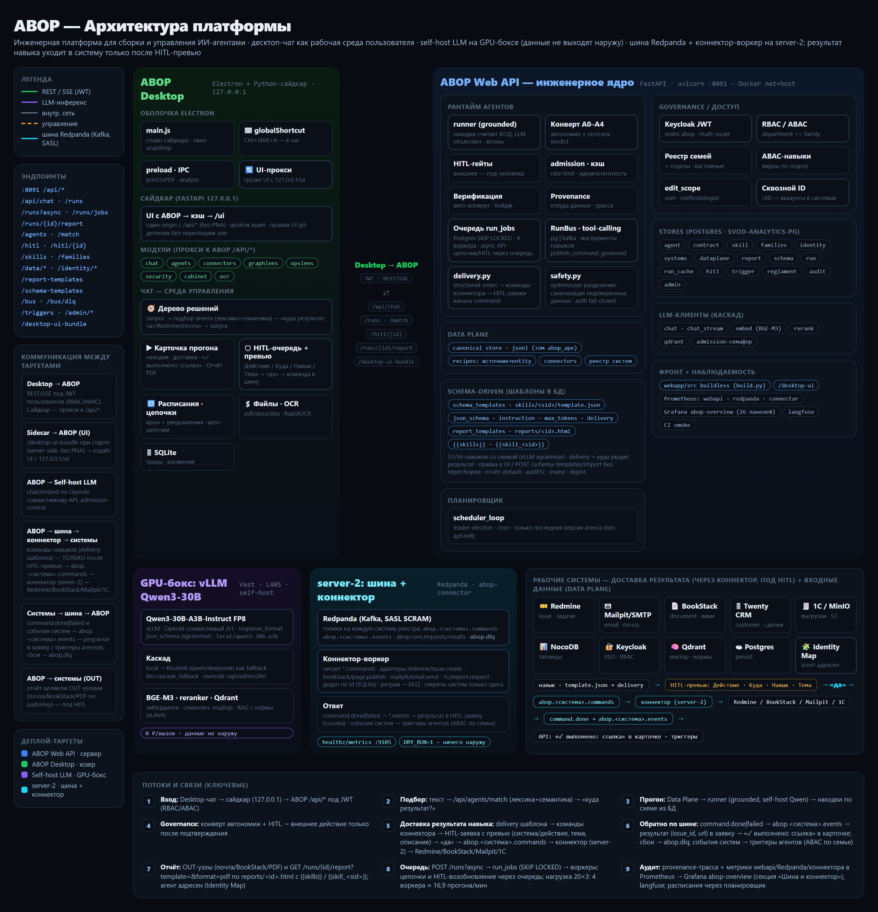

# ABOP — Agent Build & Operations Platform

Среда сборки, запуска и эксплуатации ИИ-агентов в управляемом периметре. Инженерная
половина связки **LUDA → ABOP**: LUDA (аудитор) выдаёт бизнес-вердикт готовности и три
контракта, ABOP по ним собирает, запускает и эксплуатирует агентов под жёстким конвертом
governance.

> **Два продукта — два репозитория.** Отделён из монорепо `ai-product-engineer` (учебный
> портал остаётся там). Переиспользуемые части (MCP-шлюз, навыки, CLI APE, Keycloak, инфра)
> склонированы в оба. Связь между продуктами — только через версионированные контракты, не
> через код (ADR-027). Десктоп ABOP обновляется из **собственного** канала релизов
> (`mkhlsokolenko-ai/abop`), отдельно от десктопа AI Engineer — каналы не смешиваются.

## Возможности

**Сборка и governance**
- **Канва процесса** — один граф агента с линзами **Строю / Запускаю / Эксплуатирую / Конверт** (ADR-030).
- **Сборка из контрактов LUDA** — приём бандла (`luda.*/1.0`) через Contract Ingress → `ContractSet` → посев канвы (ADR-029).
- **Конверт governance** — автономия агента ≤ `DeploymentContract` (ADR-013/028): HITL, egress-политика, аудит; UI-гейт редактирования по `can_edit`.
- **Регламент-конформанс (sLAVA)** — сверка процесса с регламентом по ключу НСИ на эмбеддингах, drift-детекция, граф-RAG, бейджи конформанса.
- **RBAC агентов на MCP-шлюзе** — изоляция доступа (read-гейт + action-гейт на доставке, deny-by-default, аудит) под сквозным Identity Map.
- **Анализ воздействия** — граф связей: что изменит правка узла, где развёрнуты агенты, цена/токены.

**Исполнение и масштаб**
- **Очередь прогонов** — durable-очередь `run_jobs` в Postgres (`SKIP LOCKED`), пул воркеров (`ABOP_RUN_WORKERS`), лимит «один активный прогон на пользователя», requeue зависших, отмена; **async API** (`POST /api/runs?async=1` → 202 + `job_id`, поллинг `GET /api/runs/jobs/{id}`). Цепочки и HITL-возобновление — тоже через очередь. Замер: 20 пользователей × 3 прогона — 4 воркера дают 16,9 прогона/мин, 0 сбоев (`bench/LOAD_RESULTS.md`).
- **Шина Redpanda** (Kafka-совместимая, server-2) — `abop.runs.requests/results`, по паре топиков `abop.<система>.events` / `abop.<система>.commands` на каждую систему реестра и единый `abop.dlq`; события шины будят триггер-узлы агентов (ABAC по семье). Без брокера — честный откат на PG-драйвер.
- **Единый tool-calling навыков** — инструменты объявляются в frontmatter `SKILL.md` (`tools:`), цикл `{"tool","args"}` / `{"final":true}` на ≤ `ABOP_TOOL_STEPS` шагов; действия наружу только через governance (реестр систем + ABAC + HITL канала `command`, dry_run по умолчанию). Плюс графики (inline-SVG) и whitelisted-расчёты `stats / group_by / top / reconcile` без `exec`.
- **Коннектор-воркер** (server-2) — исполняет `abop.*.commands`: адаптеры `redmine/issue.create`, `bookstack/page.publish`, `mailpit/email.send`, `1c/export.request`, `echo`; дедуп по id команды, ретраи, `command.done|failed` обратно в события, ошибки в DLQ. Секреты внешних систем живут только у коннектора.
- **Self-host LLM за 0 ₽** — Qwen3-30B-A3B FP8 на арендованном GPU (vLLM) первым в каскаде, RouteAI как fallback; откат каскада виден в логах (`llm.cascade_fallback`) и метрике `abop_llm_fallback_total`; адрес бокса переключается без рестарта (`POST /api/admin/llm`).
- **Цепочки агентов** — линейный конвейер «выход одного → контекст следующего», авто-сборка цепочки под задачу.

**Результат в целевой системе**
- **Шаблоны навыков** (`skills/<sid>/template.json`) — подробная strict-совместимая JSON Schema ответа + инструкция + `max_tokens`; **51 из 56 навыков** покрыты (без шаблонов только code-навыки). Источник правды — БД (`schema_templates`), репо — посев; импорт без пересборки образа (`scripts/push_templates.py`), ручная правка и сброс к репо через API. Обрезанный ответ чинится (`_repair_json`), структура рендерится читаемым текстом на доске.
- **Доставка результата: превью → HITL → коннектор** — секция `delivery` шаблона собирает команды коннектора из структурированного ответа; каждая — HITL-заявка с превью в карточке прогона; «да» публикует команду в шину, коннектор исполняет, ссылка на созданный объект возвращается в карточку. Факт с прода 27.09: находка аудитора → задача Redmine #18 за 4 с.
- **PDF-отчёт по шаблону** — шаблоны `reports/<id>.html` (default, audit1c, invest, digest) сеются в `report_templates`, правятся в веб-редакторе с превью; плейсхолдеры `{{skills}}` / `{{skill_<sid>}}` подставляют структурированные ответы навыков; `GET /api/runs/{id}/report?template=&format=html|pdf` по требованию, кнопка «Отчёт PDF» на карточке прогона в десктопе, OUT-узел канала `pdf` использует тот же шаблон.
- **Data Plane** — рецепты `source → canonical` по ключу `entity`, OUT-узлы доставки; версионное хранилище с provenance и freshness (последняя версия не протухает по времени).

**Безопасность и наблюдаемость**
- **Security fail-closed** — без Keycloak API отвечает 401 (`ABOP_DEV_AUTH=1` только dev/CI), ABAC контрактов, мутации — manager+; методика навыка в `system`, все недоверенные данные (ввод, события шины, наблюдения инструментов, контекст предыдущего агента) — санитизированные блоки в `user` (`server/safety.py`); origin-gate `postMessage`; блокирующие вызовы вынесены в потоки. Разбор red-team #48 — `docs/SECURITY_FIXES_2026-09-26.md`.
- **Observability** — сквозной `trace_id`, `/metrics` (Prometheus), Grafana-дашборд `abop-overview` (очередь, прогоны, стоимость, LLM-inflight, **шина и коннектор**: up, DLQ, лаг консьюмеров, throughput, p99, память), тайминги прогона/навыков, мягкие ошибки не глушатся.
- **Биллинг и квоты** — реальный расход токенов из `RunMetrics`, тариф local = 0 ₽, чип остатка в чате.

**Продукт и клиенты**
- **Пилот «Аудитор данных в 1С»** — журнал находок, карточки с цепочкой документов и разрывом (клик → документ в веб-клиенте 1С), слой объяснения «что не сходится / откуда / чем грозит / что проверить», слепая разметка эксперта (`/api/runs/{id}/findings/{fid}/label`) и метрики пилота (точность, межучастковые, «вручную бы не нашли»).
- **Веб** — buildless-фронт из исходников `webapp/src` (`python webapp/build.py`), честный флот из `/api/fleet`, полная ARIA, светлая/тёмная темы, веб-редакторы шаблонов, smoke-тесты в CI.
- **Десктоп 1.0.8** — тонкий клиент (Electron + Python-сайдкар): чат как среда управления агентами, HITL-очередь в чате с превью команд коннектора («Действие / Куда / Навык / Тема») и результатом выполнения в карточке прогона, авто-цепочки, «Мои / Общие агенты», Кабинет, вход Keycloak + Identity Map, хоткей `Ctrl+Shift+A`, обновление UI с сервера (Путь А) и приложения (electron-updater).

## Архитектура



> Интерактивная версия (HTML): [docs/ABOP_Architecture.html](docs/ABOP_Architecture.html)

Ключевые решения:

- **Канва-центр** (ADR-030) · **Contract Ingress** (ADR-029) · **Конверт governance** (ADR-028/013).
- **Обратная петля** (SDD §4-bis): ABOP публикует `RunMetrics` → LUDA сверяет с baseline.
- **Путь А**: UI десктопа раздаётся сервером (`/desktop-ui-bundle`), сайдкар тянет его при старте — правки UI прилетают git-деплоем без пересборки `.exe`.

Топология (подробно — `docs/DEPLOY.md`):

- **server-1** `5.129.192.63` — ABOP Web API (`abop-webapi`, :8091, воркеры очереди внутри процесса), Postgres, Keycloak, Prometheus/Grafana и демо-системы реестра (Redmine, BookStack, Twenty, Mailpit, NocoDB, MinIO…).
- **server-2** `201.51.5.24` — шина **Redpanda** (:9092 SASL, admin :9644 только для server-1), **коннектор-воркер** `abop-connector` (:9105 healthz/metrics) с секретами систем, sLAVA (RAG) + Qdrant, Gotenberg, снимок 1С.
- **GPU-бокс** (аренда, Vast L40S) — vLLM с Qwen3-30B-A3B FP8; адрес в `.env` (`LOCAL_LLM_BASE_URL`) с runtime-override через `POST /api/admin/llm`. Второй бокс на том же аккаунте — red-team, не трогать.

## Компоненты

| Путь | Что |
|---|---|
| `server/` | FastAPI/FastMCP: `web_api.py` (ABOP API), `run_queue.py` (очередь/воркеры), `run_bus.py` (RunBus: PG/Kafka, топики систем, события → триггеры), `skill_tools.py` (tool-calling + governance команд), `skill_templates.py` + `schema_store.py` (шаблоны навыков), `delivery.py` (команды из structured-ответа), `report_store.py` (шаблоны отчётов), `safety.py` (санитизация), `findings.py` (карточки пилота 1С), `ingress.py` + `contract_store.py` (Contract Ingress), MCP-шлюз с RBAC, `charts.py`/`compute.py`, auth/db/clients/pricing/config |
| `connector/` | Коннектор-воркер шины (`worker.py`, `Dockerfile`): адаптеры Redmine/BookStack/Mailpit/1С, дедуп, ретраи, DLQ, `/healthz` + `/metrics` :9105 |
| `webapp/` | Buildless-React фронт ABOP: исходники `src/` (`template.html`, `components/*.dc.html`, `vendor/`, `fonts/`), сборка `build.py` → `index.html` (артефакт), дизайн-токены `tokens.css` |
| `desktop/` | **ABOP Desktop** — тонкий клиент: Electron-оболочка (`electron/`), Python-сайдкар (`sidecar/`, FastAPI-прокси к ABOP под JWT), UI (`ui/`, раздаётся сервером по Пути А), сборка сайдкара PyInstaller (`build-sidecar.spec`) |
| `cli/` | **APE** — CLI доступа к моделям и ядро навыков/Data Plane (общий с учебным репо) |
| `skills/` | Декларативные навыки агентов (`SKILL.md`: mode/egress/cite/`tools:`) + `skills/<sid>/template.json` — шаблон извлечения и доставки (51/56) |
| `reports/` | Шаблоны PDF/HTML-отчётов (`default`, `audit1c`, `invest`, `digest`) — посев `report_templates`, правка в веб-редакторе имеет приоритет |
| `scripts/` | `push_templates.py` (импорт шаблонов навыков в БД работающего ABOP без пересборки), `check_templates.py` (strict-совместимость + секция `delivery`) |
| `tests/` | `test_smoke_api.py` (API in-process без Postgres/Keycloak), `test_bus_tools.py` (tool-calling, DLQ-хук, события → триггеры), `smoke_web.py` (страница веба в браузере) |
| `bench/` | Выбор модели (гейт), проверка RAG/изоляции тенантов, `load_test.py` + `LOAD_RESULTS.md` (нагрузка очереди) |
| `demo/` | Демо-пакеты сценариев: `audit1c/`, `invest1c/`, `fin/` (contract*.json + agent_body.json + recipes/norms) |
| `ops/` | Эксплуатация: `deploy-webapi.sh`, `docker-compose.observability.yml`, `prometheus.yml` (цели: abop-webapi, redpanda, abop-connector), `grafana/` (provisioning + дашборд `abop-overview`) |
| `docs/` | Документация — индекс в [`docs/README.md`](docs/README.md) |
| `.github/workflows/` | `ci.yml` — smoke API + сборка бандла веба, smoke страницы в браузере, desktop-guard (версия/тег); `desktop-release.yml` — тег `desktop-vX.Y.Z` → инсталлятор в GitHub Releases |
| `keycloak/`, `db/`, `docker-compose.yml`, `Caddyfile`, `Dockerfile.webapi` | Инфраструктура (OIDC, Postgres, TLS, образ API — в него копируются `server/ cli/ skills/ webapp/ demo/ desktop/ui`) |

## Установка

### Десктоп (для пользователей)

Скачать последний инсталлятор со страницы релизов:
**[github.com/mkhlsokolenko-ai/abop/releases](https://github.com/mkhlsokolenko-ai/abop/releases)** → `ABOP Desktop Setup X.Y.Z.exe`.

- Инсталлятор без подписи → при первом запуске Windows SmartScreen: «Подробнее» → «Выполнить в любом случае».
- **Авто-обновление:** приложение само проверяет обновления при старте; когда доступна новая версия — в UI появляется баннер **«⬇ Найдено обновление»** → кнопка **«Установить и перезапустить»**. Переустанавливать вручную не нужно.
- **UI обновляется без переустановки** (Путь А): свежий интерфейс подтягивается с сервера при перезапуске приложения.

Сборка десктопа из исходников — см. **[desktop/README.md](desktop/README.md)** (PyInstaller + electron-builder).

### Сервер / dev

```bash
# 1. окружение
cp .env.example .env          # заполнить ключи моделей и пр.

# 2. ABOP Web API + фронт (StaticFiles отдаёт webapp/)
uvicorn server.web_api:app --reload --port 8091
# → http://127.0.0.1:8091  (фронт) · /api/health · /api/contracts/ingest
# без Keycloak API закрыт (401) — для локальной разработки: ABOP_DEV_AUTH=1

# 3. CLI APE (доступ к моделям)
pip install -e ./cli          # или без установки: python cli/ape.py <команда>
ape login                     # вход через GitHub (браузер)
ape code "напиши FastAPI-эндпоинт /health с тестом на pytest"
ape ask  "сравни подходы к очередям задач"
```

Прод-развёртывание, восстановление Data Plane, конфигурация и частые проблемы —
**[docs/DEPLOY.md](docs/DEPLOY.md)**; все эндпоинты и порты — **[docs/API_ENDPOINTS_PORTS.md](docs/API_ENDPOINTS_PORTS.md)**.

## Эксплуатация

- **[docs/README.md](docs/README.md)** — индекс документации (актуальные runbook'и и исторические спецификации).
- **[docs/DEPLOY.md](docs/DEPLOY.md)** — топология двух серверов + GPU-бокс, переменные окружения, раскатка кода и шаблонов, Redpanda/коннектор, LLM-бокс, восстановление Data Plane, частые проблемы.
- **[docs/API_ENDPOINTS_PORTS.md](docs/API_ENDPOINTS_PORTS.md)** — эндпоинты API, порты сервисов, env-переменные.
- **[docs/SKILL_TEMPLATES.md](docs/SKILL_TEMPLATES.md)** — шаблоны извлечения навыков, персистентность в БД, доставка результата превью → HITL → коннектор.
- **[docs/CONNECTOR_WORKER.md](docs/CONNECTOR_WORKER.md)** — коннектор-воркер на server-2: поток, адаптеры, секреты, DLQ, наблюдаемость.
- **[docs/CONCEPT_SCALING_OBSERVABILITY.md](docs/CONCEPT_SCALING_OBSERVABILITY.md)** — концепция масштабирования; §13–15 — что реализовано (очередь, цепочки/HITL через очередь, шина, tool-calling, нагрузка).
- **[docs/SECURITY_FIXES_2026-09-26.md](docs/SECURITY_FIXES_2026-09-26.md)** — разбор red-team #48: fail-closed auth, ABAC, санитизация промптов, аудит блокирующих вызовов.
- **[docs/RELEASE_DISCIPLINE.md](docs/RELEASE_DISCIPLINE.md)** — правки веба (исходники → бандл) и десктопа (версия + тег), CI-гейты.
- **[docs/PILOT_1C_FINDINGS.md](docs/PILOT_1C_FINDINGS.md)** — продукт пилота 1С: карточки находок, разметка, метрики.
- **[docs/INSTRUKCIYA_ZAPUSK_AGENTA.md](docs/INSTRUKCIYA_ZAPUSK_AGENTA.md)** — пошагово для не-технического пользователя.

## Тесты

```bash
ABOP_DEV_AUTH=1 pytest -q                                   # API in-process (без Postgres/Keycloak) + шина/tool-calling
python webapp/build.py check                                # бандл веба совпадает с исходниками webapp/src
python scripts/check_templates.py skills/*/template.json    # strict-совместимость шаблонов навыков + секция delivery
python tests/smoke_web.py                                   # при поднятом сервере: страница рендерится, ARIA/навигация, без ошибок JS
```

Те же шаги выполняет CI (`.github/workflows/ci.yml`) на каждый push/PR.
